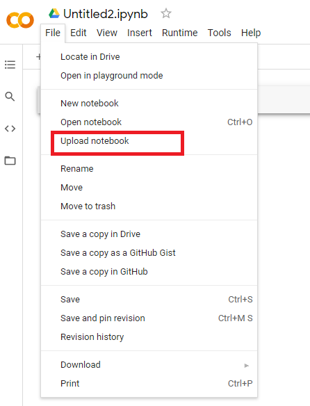

# FastBenchmark
FastBenchmark generates an exploratory report, and a base ML model 
which you can use in google colab (https://colab.research.google.com/).
All you need is a dataset in scv format, and a target variable name
(what you want to predict).  

Project site: https://www.fastbenchmark.me/google-colab

## Install requirements
You can install all project requirements from requirements.txt
using the following command:

```
python -m pip install -r requirements.txt --user
```

## Quick start
Demo video: https://youtu.be/8xw9CBYveJQ
Here is an example of how to use FastBenchmark app to get a report in 
google colab

### Generate the report
To generate the report you need to:  

1. Load your dataset (you can use any dataset from 'data' path or your own dataset)
2. Select the variable which you want to predict
3. Select a metric (if you will choose rmsle, FastBenchmark will make a log transformation for your target variable - that will make a prediction a bit better)
4. Select which variables to use (you can for example unselect all variables with a lot of NaN values)
5. Push 'get report' button  

Your report will be saved into 'reports' path  


### Open report in google colab and upload your dataset
Now you need to open google colab: https://colab.research.google.com/  
And upload a report file from you 'reports' path by using 'upload notebook' 
option:  
  

As you are done, you need to upload your data set:  

1. Open files section  

   
2. Upload your dataset  


### Run the code
Now you can run your notebooks code by using 'Run all' option:  
  

After some time you will get an exploratory report, and a base ML model to predict your target  
